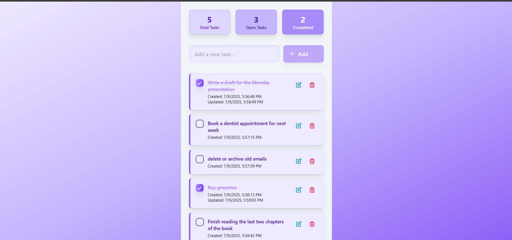

# Todo App



A Full-stack Todo application built with the MERN stack (MongoDB, Express.js, React, Node.js) featuring a beautiful UI with Tailwind CSS.

## Features

- **Modern UI/UX** - Beautiful design with Tailwind CSS
- **Fully Responsive** - Works perfectly on desktop, tablet, and mobile
- **Real-time Updates** - Instant task management with smooth animations
- **CRUD Operations** - Create, Read, Update, Delete tasks
- **Task Completion** - Mark tasks as complete/incomplete
- **Timestamps** - Track creation and update times
- **Smooth Animations** - Fade-in, slide-up, and bounce animations
- **Error Handling** - Comprehensive error handling and user feedback
- **Fast Performance** - Optimized with Vite and modern React patterns

## Tech Stack

### Frontend

- **React 19** - Modern React with hooks and functional components
- **Tailwind CSS** - Utility-first CSS framework for rapid UI development
- **Axios** - HTTP client for API communication
- **Vite** - Fast build tool and development server

### Backend

- **Node.js** - JavaScript runtime
- **Express.js** - Web application framework
- **MongoDB** - NoSQL database with Mongoose ODM
- **CORS** - Cross-origin resource sharing
- **dotenv** - Environment variable management

## Project Structure

```
TO-Do-App/
├── frontend/                 # React frontend application
│   ├── src/
│   │   ├── App.jsx          # Main application component
│   │   ├── main.jsx         # Application entry point
│   │   └── index.css        # Tailwind CSS and custom styles
│   ├── public/
│   ├── package.json
│   ├── tailwind.config.js   # Tailwind configuration
│   └── vite.config.js       # Vite configuration
├── backend/                  # Node.js backend API
│   ├── config/
│   │   └── db.js            # MongoDB connection configuration
│   ├── controllers/
│   │   └── taskController.js # Task CRUD operations
│   ├── models/
│   │   └── Task.js          # Mongoose task model
│   ├── routes/
│   │   └── taskRoutes.js    # API route definitions
│   ├── server.js            # Express server setup
│   └── package.json
└── README.md
└── screenshot.png (for the github)
```

## Getting Started

### Prerequisites

- Node.js (v16 or higher)
- npm or yarn
- MongoDB Atlas account

### Installation

1. **Clone the repository**

   ```bash
   git clone https://github.com/MohamadAlhussain/Todo.git
   cd Todo
   ```

2. **Backend Setup**

   ```bash
   cd backend
   npm install
   ```

3. **Environment Configuration**
   Create a `.env` file in the backend directory:

   ```env
   MONGO_URI=your_mongodb_connection_string
   PORT=5000
   ```

4. **Start Backend Server**

   ```bash
   npm run dev
   ```

   The backend will run on `http://localhost:5000`

5. **Frontend Setup** (in a new terminal)

   ```bash
   cd frontend
   npm install
   ```

6. **Start Frontend Development Server**
   ```bash
   npm run dev
   ```
   The frontend will run on `http://localhost:5173`

## API Endpoints

| Method | Endpoint         | Description       |
| ------ | ---------------- | ----------------- |
| GET    | `/api/tasks`     | Get all tasks     |
| POST   | `/api/tasks`     | Create a new task |
| PUT    | `/api/tasks/:id` | Update a task     |
| DELETE | `/api/tasks/:id` | Delete a task     |

### Request/Response Examples

**Create Task**

```bash
POST /api/tasks
Content-Type: application/json

{
  "title": "Complete project documentation"
}
```

**Response**

```json
{
  "_id": "60f7b3b3b3b3b3b3b3b3b3b3",
  "title": "Complete project documentation",
  "isCompleted": false,
  "createdAt": "2024-01-15T10:30:00.000Z",
  "updatedAt": "2024-01-15T10:30:00.000Z"
}
```

## Available Scripts

### Frontend

- `npm run dev` - Start development server
- `npm run build` - Build for production
- `npm run preview` - Preview production build
- `npm run lint` - Run ESLint

### Backend

- `npm run dev` - Start development server with nodemon
- `npm start` - Start production server

## What I Learned

- How to build a full-stack application using the MERN stack (MongoDB, Express.js, React, Node.js)
- How to design and customize modern UIs with Tailwind CSS, including custom palettes and gradients
- Best practices for managing environment variables and secure configuration
- The importance of iterative UI/UX design and user feedback for a polished product
- How to clean up and prepare a project for production and open source release

---

Made with Love by Mohamad Alhussain
